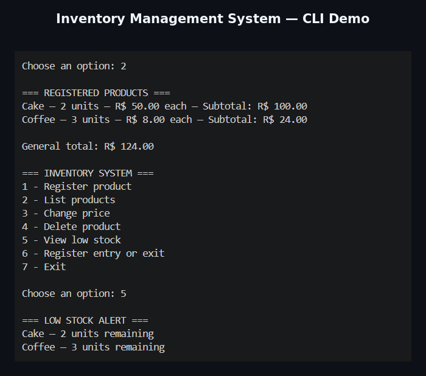

# Inventory Management System

A modular command-line inventory management application built with Python for small businesses. The system provides essential product and stock control features through a simple and reliable interface.
## Demo

## Features

* Product registration
* Product listing
* Price updates
* Product deletion with confirmation
* Stock entry and withdrawal
* Low-stock alerts
* Input validation and error handling
* Persistent CSV data storage
* Automatic data-file creation
- Automated unit tests with Python `unittest`
## Technologies

* Python
* CSV
* Git
* GitHub

## Project Structure

* `main.py` — application menu and user interaction
* `system_products.py` — inventory rules, validation and file operations
* `products.csv` — automatically generated local data storage

## Getting Started

Clone the repository:

`git clone https://github.com/Lucas-LBR/inventory-management-system.git`

Enter the project directory:

`cd inventory-management-system`

Run the application:

`python main.py`

No external libraries are required.

## Concepts Demonstrated

* CRUD operations
* Functions and modular programming
* Lists and dictionaries
* Loops and conditional logic
* Exception handling
* File reading and writing
* CSV data persistence
* Git version control
## Running Tests

Run the complete automated test suite with:

`python -m unittest -v`

The tests use temporary CSV files and do not modify the application's real inventory data.
## Future Improvements

* Stock movement history
* Product search and filtering
* SQLite database integration
* Graphical user interface
* Inventory reports
* User authentication

## Author

Developed by [Lucas-LBR](https://github.com/Lucas-LBR).
